# HELLO

**Building • Experimenting • Learning**

<!-- hero: monochrome ASCII portrait beside the 3D ASCII wordmark
     portrait: node scripts/ascii-portrait.js source-prepped.png
     wordmark: python scripts/make_wordmark_svg.py --mode rock
     both panels land at the same height via width tuning -->

<table>
<tr>
<td valign="top"></td>
<td valign="top"></td>
</tr>
</table>

 
 

<!-- animated contribution graph: real data, boxes reveal cell by cell
     regenerated daily via GitHub Actions workflow -->

 
 

